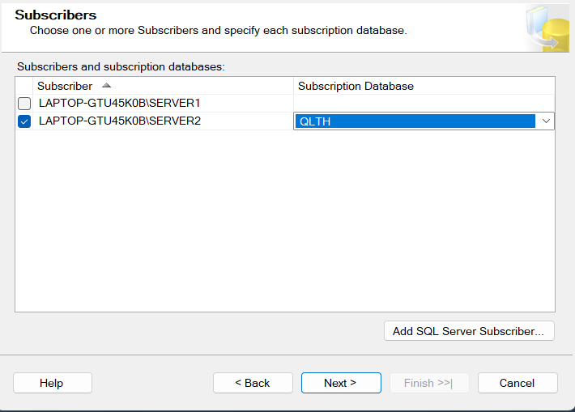

# FE_CDSLPT
# Mô hình dữ liệu phân tán trong Quản lý thông tin học tập

## 1. Giới thiệu
Đề tài nghiên cứu và triển khai mô hình cơ sở dữ liệu phân tán phục vụ cho việc quản lý thông tin học tập. Hệ thống được xây dựng nhằm đảm bảo tính sẵn sàng, phân mảnh dữ liệu theo khu vực hoặc bộ môn, và hỗ trợ mở rộng.

## 2. Mục tiêu và các tính năng
- Mục tiêu chính của hệ thống là quản lý hiệu quả các hoạt động của hệ thống trường học có nhiều nhánh, bao gồm quản lý thông tin học sinh, giáo viên, khóa học và điểm số của từng học sinh. 
- Cơ sở dữ liệu phân tán đề xuất: Phân tán dựa theo BranchID(Chi nhánh). Hệ thống sẽ bao gồm nhiều thành phần con. Đầu tiên là hệ thống quản lý thông tin học sinh, cho phép lưu trữ và quản lý hồ sơ học sinh, bao gồm thông tin cá nhân, điểm số và lớp học. Tiếp theo là hệ thống quản lý khóa học, cung cấp danh sách các khóa học, môn học và lớp học tương ứng với từng môn học. Cuối cùng, hệ thống quản lý điểm số sẽ theo dõi và quản lý điểm số của từng học sinh đối với các môn học mà họ đã đăng ký.
- Cài đặt và triển khai hệ thống với 3 node tương ứng với chi nhánh trung tâm và 2 chi nhánh bắc và nam. Hỗ trợ truy vấn nhanh tại các chi nhánh

## 3. Kiến trúc hệ thống
- Frontend: NetBean kết hợp với giao diện kéo thả JavaSwing
- Backend: Java
- Database: Sql Server
- Cấu trúc dự án 
src/main
  java/com/mycompany
    DAO
      DangKyDAO.java
      DiemDAO.java
      LopHocDAO.java
      MonHocDAO.java
      SinhVienDAO.java
      UserDAO.java
    DatabaseHelper
      DatabaseConnectionManager.java
    model
      DangKy.java
      Diem.java
      LopHoc.java
      MonHoc.java
      SinhVien.java
    qlsv
      HomeForm.form
      HomeForm.java
      LoginForm.form
      LoginForm.java
      QLSV.java
resources/com.company.icon
target
README.md
pom.xml

## 4. Hướng dẫn cài đặt
1. Clone dự án https://github.com/phunguyengif/FE_CDSLPT.git
2. Cài đặt database:
   Tạo 3 cơ sở dữ liệu: Trung tâm, Chi nhánh miền Nam, Chi nhánh miền Bắc

   clone script cho sơ sở trung tâm: https://github.com/phunguyengif/CSDLPT_QLTH.git. Và tạo cơ sở dữ liệu

   Tiến hành phân mảnh:

   Bước 1: Chuẩn bị môi trường

      Kiểm tra quyền truy cập:

         SQL Server Agent phải được kích hoạt trên cả Publisher và Subscriber.

      Xác định Publisher và Subscriber:

         Publisher: Máy chủ chứa dữ liệu gốc sẽ được nhân bản.

         Subscriber: Máy chủ nhận dữ liệu từ Publisher.

      Cấu hình cơ sở dữ liệu:

         Xác định các bảng hoặc dữ liệu cần phân mảnh.

         Đảm bảo mỗi bảng có một khóa chính (Primary Key).

   Bước 2: Cấu hình Publisher (Máy chủ xuất bản)

      Thiết lập Distributor:

         Trong SQL Server Management Studio (SSMS):

         Kết nối đến máy chủ Publisher

         Chuột phải vào Replication → Configure Distribution.

         Làm theo hướng dẫn để cấu hình Distributor (có thể trên cùng máy với Publisher).

      Tạo Publication:

         Chuột phải vào Local Publications → New Publication.

         Chọn cơ sở dữ liệu để xuất bản.

       Chọn loại replication là Merge Replication.

         Chọn các bảng hoặc đối tượng cần xuất bản:
      
         Thiết lập các thuộc tính khác (như lịch trình đồng bộ).

      Tạo Snapshot:

         Sau khi tạo Publication, SQL Server sẽ tạo một bản Snapshot để khởi tạo cho các Subscriber.

         Chuột phải vào Publication → View Snapshot Agent Status để đảm bảo quá trình Snapshot thành công.

   Bước 3: Cấu hình Subscriber (Máy chủ nhận bản sao)

      Thêm Subscriber:

         Chuột phải vào Local Subscriptions → New Subscriptions.

         Chọn Publication vừa tạo.

         Chọn máy chủ Subscriber và cơ sở dữ liệu tương ứng: 
      .
         Định cấu hình lịch trình đồng bộ (Continuous hoặc On-Demand).

   Kích hoạt Subscription:

      Sau khi thiết lập, SQL Server sẽ tự động đồng bộ dữ liệu giữa Publisher và Subscriber theo lịch trình

   Tạo Publications và Subscriptions 

3. Tải NetBean https://netbeans.apache.org/front/main/download/nb22/ tải file Apache-NetBeans-22-bin-windows-x64.exe
4. Tải các phụ thuộc:
   Jdk 22: 	https://download.oracle.com/java/22/archive/jdk-22.0.2_windows-x64_bin.exe (sha256)
5. Set UP file config :
Mở ứng dụng SSMS:
Đặt lại Post cho các database:
   Database Trung tâm: localhost:1433
   Database Chi Nhánh Miền Nam: localhost: 1434
   Database Chi Nhánh Miền Bắc: localhost: 1435
6. Chạy ứng dụng:
    Trong NetBean mở project FE_CSDLPT vừa mới pull từ git về
    Trong Project Files -> pom.xml thêm file dependence để thêm vào phương thức kết nối với database
        <dependencies>
        <dependency>
            <groupId>com.microsoft.sqlserver</groupId>
            <artifactId>mssql-jdbc</artifactId>
            <version>10.2.3.jre17</version>
        </dependency>
    </dependencies>
    Run file QLSV để chạy dự án

## 4.Hướng dẫn sử dụng
1. Vai trò giáo viên 
   Chọn chi nhánh
   Đăng nhập vào hệ thống bằng tài khoản giáo viên (Tk: admin_hcm, mk: 123456)
   Sau khi đăng nhập, sẽ chuyển sang giao diện chính: gồm các phần như quản lý sinh viên, quản lý môn học, quản lý điểm, quản lý lớp học
   Thực hiện các chức năng quản lý
2. Vai trò sinh viên
   Chọn chi nhánh 
   Tick vào ô Sinh Viên
   Đăng nhập vào hệ thống bằng tài khoản Sinh viên (TK: Mã số sinh viên, MK: Tên sinh viên)
   Thực hiện chức năng đăng ký lớp học
3. Ví dụ 1 vài chức năng
   *Thêm sinh viên:
      Sau khi giáo viên đăng nhập thành công
      Giao diện sinh viên bao gồm các chức năng thêm, xóa, sửa sinh viên
      Tại giao diện quản lý sinh viên: Giáo viên nhấn vào button thêm rồi điền đầy đủ thông tin sinh viên sau đó nhấn vào button lưu.
      Nếu lưu thành công thì thông báo "Thêm sinh viên thành công". Ngược lại thông báo lỗi.
### Yêu cầu hệ thống
- SQL Server, Java, NetBean, jdk 22
## 5.Tác giả và bản quyền
1. Tác giả : Nguyễn Thanh Phú, N22DCCN060

